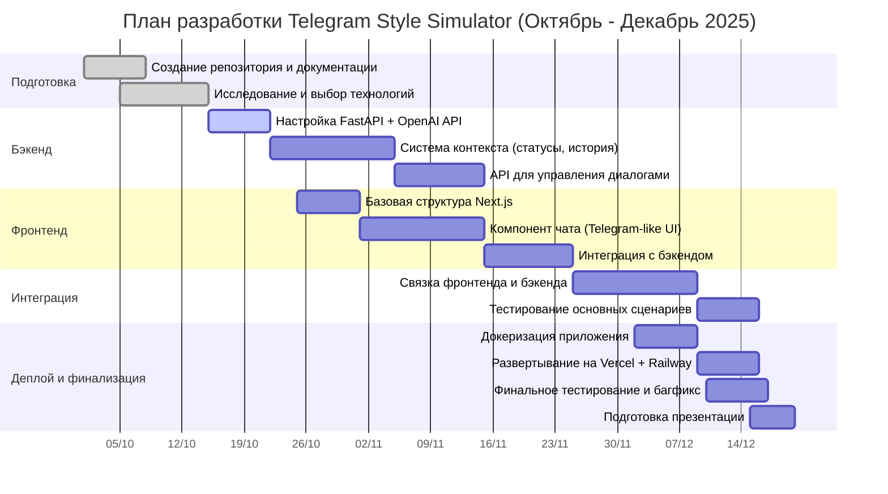

# Telegram Style Simulator - План проекта

## Диаграмма Ганта

```mermaid
gantt
    title План разработки Telegram Style Simulator (Октябрь - Декабрь 2025)
    dateFormat  YYYY-MM-DD
    axisFormat %d/%m
    section Подготовка
    Создание репозитория и документации     :done, 2025-10-01, 7d
    Исследование и выбор технологий         :done, 2025-10-05, 10d
    section Бэкенд
    Настройка FastAPI + OpenAI API         :active, 2025-10-15, 7d
    Система контекста (статусы, история)    :2025-10-22, 14d
    API для управления диалогами           :2025-11-05, 10d
    section Фронтенд
    Базовая структура Next.js              :2025-10-25, 7d
    Компонент чата (Telegram-like UI)      :2025-11-01, 14d
    Интеграция с бэкендом                  :2025-11-15, 10d
    section Интеграция
    Связка фронтенда и бэкенда            :2025-11-25, 14d
    Тестирование основных сценариев       :2025-12-09, 7d
    section Деплой и финализация
    Докеризация приложения                :2025-12-02, 7d
    Развертывание на Vercel + Railway     :2025-12-09, 7d
    Финальное тестирование и багфикс      :2025-12-10, 7d
    Подготовка презентации                :2025-12-15, 5d
```